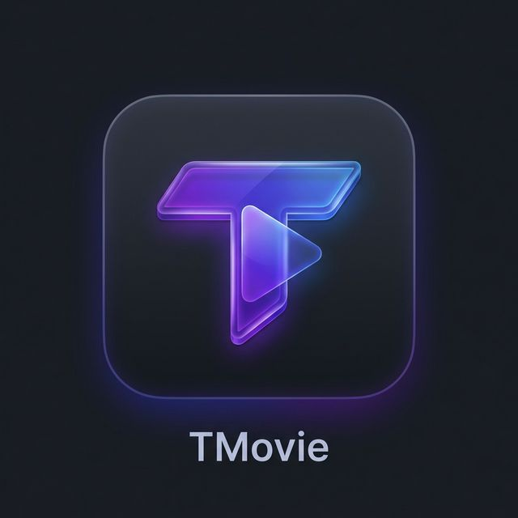
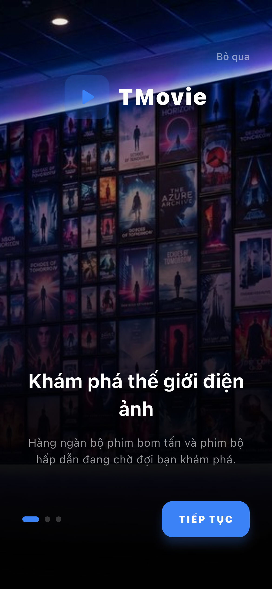
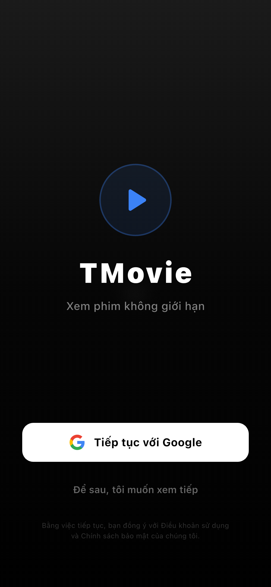
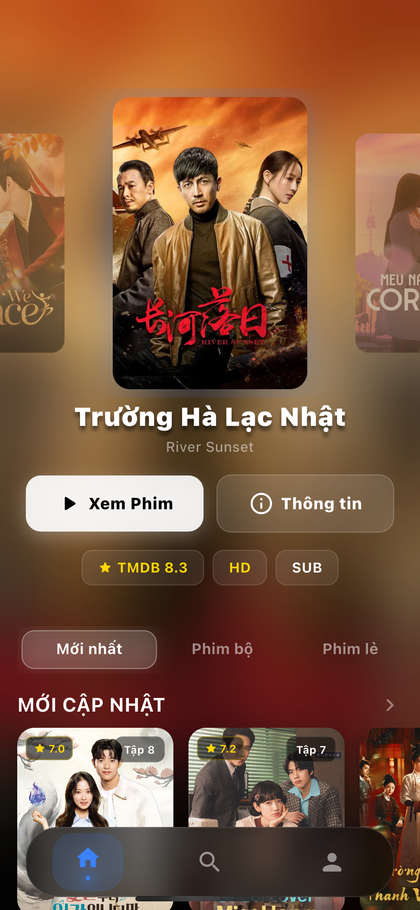
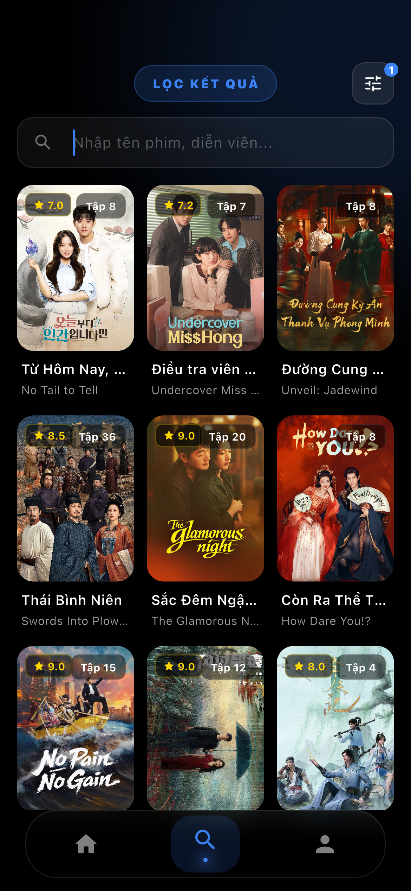
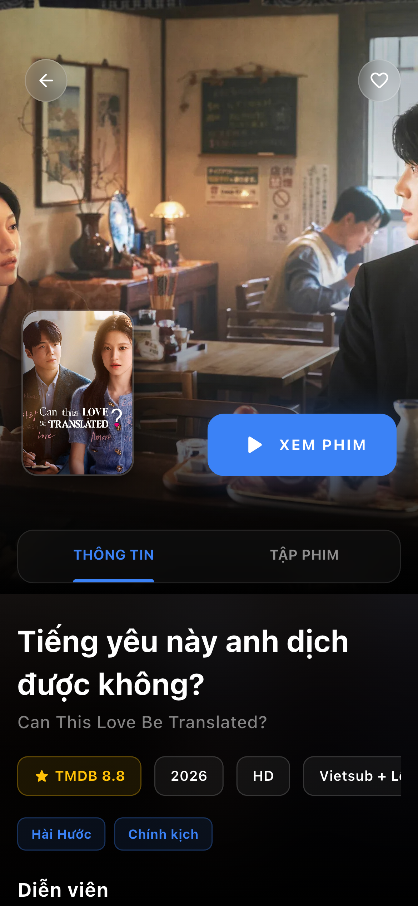
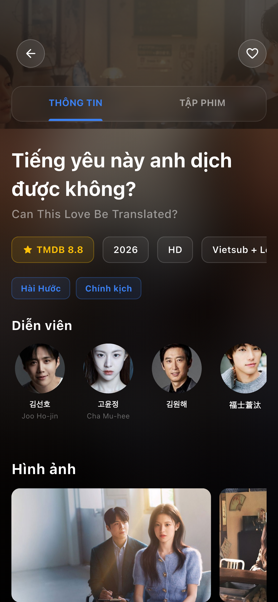
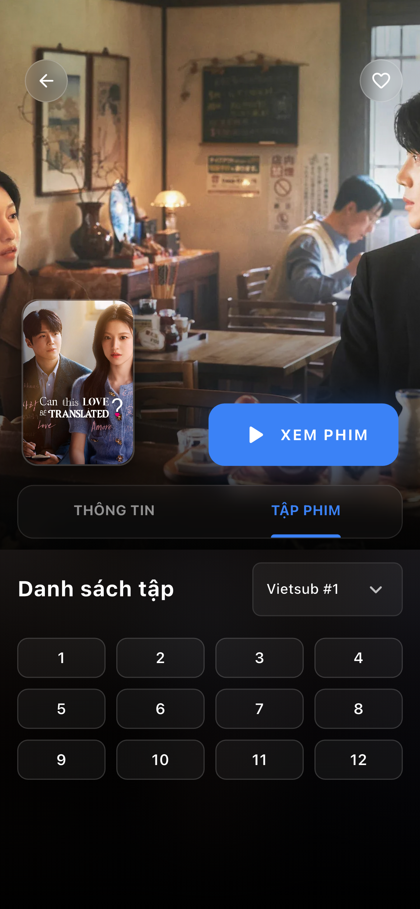

#  TMovie - Premium Cinema Experience

[](https://flutter.dev)
[](https://riverpod.dev)
[](https://firebase.google.com)
[](https://opensource.org/licenses/MIT)

**TMovie** is a high-end online movie streaming application, delivering a premium cinema experience directly to your mobile devices (iOS/Android) and Android TV. Built with a modern, smooth design philosophy centered around the user.

---

## ✨ Premium Features

- 🎨 **Glassmorphism UI**: Modern design with luxury frosted glass effects, providing a high-end and sophisticated feel.
- 🎬 **Cinematic Video Player**: 100% custom controller, supporting 10s seek, episode selection, and server switching directly while watching.
- 🔗 **Cloud Sync**: One-tap Google Sign-In to save watch history and favorite movie lists across all devices via Firestore.
- ⚡ **Exceptional Performance**: Built on Flutter with Riverpod State Management for instant response speeds.
- 📺 **Multi-platform Support**: Unified experience from compact mobile screens to sharp 4K TV displays.

---

## 📸 Screenshots

| <br><sub><b>Onboarding</b></sub> | <br><sub><b>Google Login</b></sub> | <br><sub><b>Home Screen</b></sub> |
| :---: | :---: | :---: |
| <br><sub><b>Search & Filter</b></sub> | <br><sub><b>Movie Info</b></sub> | <br><sub><b>Cast & Crew</b></sub> |
| <br><sub><b>Episodes List</b></sub> | | |

---

## 🛠 Tech Stack

| App Layer | Technology |
| :--- | :--- |
| **State Management** | `flutter_riverpod` (v2.6+) |
| **Networking** | `dio` + `retrofit` |
| **Navigation** | `go_router` |
| **Video Engine** | `video_player` + `chewie` (Customized) |
| **Backend** | `Firebase Auth` + `Cloud Firestore` |
| **Monorepo** | `Melos` |

---

## 📂 Project Structure

```text
tmovie_ft/
├── apps/
│   ├── mobile/          # 📱 iOS & Android Application
│   └── tv/              # 📺 Android TV Application (Leanback)
├── packages/
│   └── core/            # 📦 Shared: models, API, providers, widgets
└── screenshots/         # 🖼 App Screenshot Gallery
```

---

## 🚀 Getting Started

### System Requirements
- Flutter SDK >= 3.38.0
- Dart SDK >= 3.8.0
- Melos (`dart pub global activate melos`)

### Setup Steps
1. **Clone the repository:**
   ```bash
   git clone https://github.com/qthien202/tmovie_ft.git
   cd tmovie_ft
   ```

2. **Initialize dependencies:**
   ```bash
   melos bootstrap
   ```

3. **Auto-generate code (Models/Retrofit):**
   ```bash
   melos run build_runner
   ```

4. **Configure Firebase (required):**

   This project uses Firebase for Google Sign-In and cloud sync. You need to create your own Firebase project:

   **Step 1**: Go to [Firebase Console](https://console.firebase.google.com) → Create a new project

   **Step 2**: Add your apps to the Firebase project:
   - **Android**: Add Android app with package name `com.thientech.mobile` (or your own)
   - **iOS**: Add iOS app with bundle ID `com.thientech.mobile` (or your own)

   **Step 3**: Download and place config files:
   ```text
   apps/mobile/android/app/google-services.json    ← from Firebase (Android)
   apps/mobile/ios/Runner/GoogleService-Info.plist  ← from Firebase (iOS)
   ```
   > See `.example` files in these directories for reference.

   **Step 4**: Create `apps/mobile/lib/firebase_options.dart` from the template:
   ```bash
   cp apps/mobile/lib/firebase_options.dart.example apps/mobile/lib/firebase_options.dart
   ```
   Then replace the placeholder values with your Firebase project config (found in Firebase Console → Project Settings).

   **Step 5** (iOS only): Update `CFBundleURLSchemes` in `apps/mobile/ios/Runner/Info.plist`:
   - Open your downloaded `GoogleService-Info.plist`, find the `REVERSED_CLIENT_ID` value
   - Replace the existing `com.googleusercontent.apps.xxx` value in `Info.plist` → `CFBundleURLSchemes` with your reversed client ID

   **Step 6**: Enable Firebase services:
   - **Authentication** → Sign-in method → Enable **Google**
   - **Cloud Firestore** → Create database → Start in **test mode**

   **Firestore Security Rules** (recommended for production):
   ```javascript
   rules_version = '2';
   service cloud.firestore {
     match /databases/{database}/documents {
       match /users/{userId}/{document=**} {
         allow read, write: if request.auth != null && request.auth.uid == userId;
       }
     }
   }
   ```

5. **Run the application:**
   ```bash
   # Mobile
   cd apps/mobile && flutter run

   # TV
   cd apps/tv && flutter run
   ```

---

## 📖 Documentation
- 🏗 [System Architecture](docs/architecture.md)
- 🔌 [API Details (OPhim)](docs/api.md)
- 📝 [Feature List](docs/features.md)

---

<p align="center">
  Made with ❤️ by <b>TMovie Team</b>
</p>
